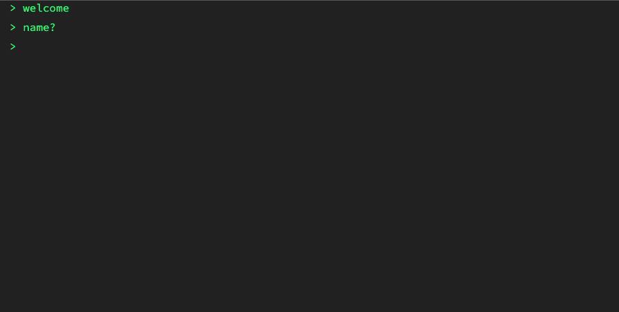

# batchat
batchat is a chat app that takes inspiration from The Batman's (2022) rataalada

[Live link](https://thebatchat.herokuapp.com)

batchat allows users to create chat rooms and send messages that will delete itself after 3 days

# Table of Contents
- [Key Features](#key-features)
- [Process](#process)
- [Credits](#credits)

# Key Features
- selecting a name
- creating chat rooms
- entering existing chat rooms
- sending messages
- receiving messages in real time with sockets

# Process
Before this project my only experience with databases was SQL. I had never learned or used an NoSQL database before and wanted to learn. I spent the beginning of the project learning about the differences between a relational (SQL) and NoSQL databases (specifically document databases). 

After learning basic CRUD commands for MongoDB I proceeded to learn how to implement MongoDB with Node.js using the native drivers. The front end was built with HTML, CSS, and JavaScript. The Socket.IO portion was add last.

I chose to use a document database instead of a relational database due to the simplicity of the project (and I wanted to learn MongoDB). Each chat room is essentially one document that contains an array of all the messages along with other data about the room itself. It was a convenient database that worked fairly well for this project. I understand that storing the messages embedded into one document isn't ideal and it may be better to store the data using SQL where chat rooms and their data are in one table and each room could have their own table for messages. 

# Credits
## Built With
- [Node.js](https://nodejs.org/en/)
- [Express](https://expressjs.com)
- [MongoDB](https://www.mongodb.com)
- [Socket.IO](https://socket.io)

## Resources
- [Relational Databases vs NoSQL Document Databases](https://lennilobel.wordpress.com/2015/06/01/relational-databases-vs-nosql-document-databases/)
- [Socket.IO - broadcast.to vs sockets.in](https://stackoverflow.com/questions/6873607/socket-io-rooms-difference-between-broadcast-to-and-sockets-in)

